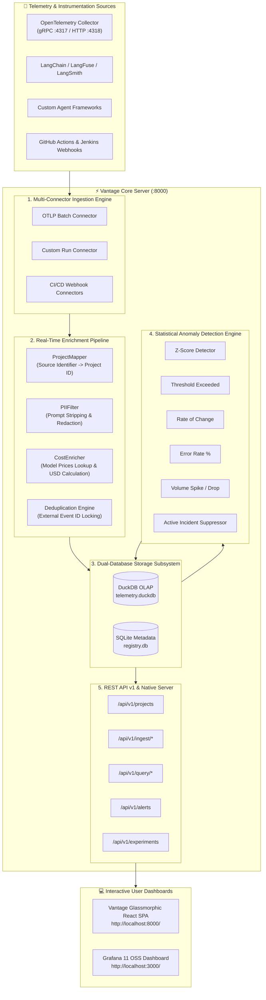

# ⚡ Vantage — AI Agent & Infrastructure Observability Engine

> **Universal Observability, Real-Time LLM Token Cost Tracking, Multi-Signal Anomaly Detection, and Experiment Registry for Modern AI Stack Infrastructure.**

---

## 🌟 Overview

**Vantage** is an enterprise-grade observability platform designed for AI-native applications, multi-agent frameworks, and CI/CD pipelines. It aggregates telemetry spans, calculates granular LLM token costs across models (OpenAI, Anthropic, Gemini), detects infrastructure anomalies across 5 statistical algorithms, manages experiment registries, and serves interactive dashboards via a **React SPA** and **Grafana OSS**.

---

## 🏗️ Architecture Overview

Vantage uses a **Dual-Database Storage Model**:
1. **DuckDB (OLAP Engine)** — High-performance analytical column-store for telemetry spans, execution traces, token pricing, and metric aggregations.
2. **SQLite (Metadata Store)** — Transactional metadata repository for project mappings, detector configurations, active incident states, and experiment registries.



---

## ✨ Feature Highlights

- **📊 Single-Port React SPA Native Serving**: Built with Vite, React Router v6, TypeScript, Lucide Icons, and glassmorphic UI tokens. Served directly on `http://localhost:8000/`.
- **💰 Real-Time LLM Token Pricing Engine**: Automatically calculates exact USD cost for LLM calls (`gpt-4o`, `claude-3-5-sonnet`, `gemini-2.0-flash`) based on token usage.
- **🔍 Agent Cost & Trace Aggregation**: Groups child LLM execution spans under root agent runs (`parent_span_id IS NULL`) without row multiplication.
- **🚨 5 Statistical Anomaly Detectors**:
  - `Z-Score Detector` (Rolling baseline standard deviation)
  - `Threshold Detector` (Hard upper bound violations)
  - `Rate Change Detector` (Sudden cost/latency jumps)
  - `Error Rate Detector` (Error % thresholds)
  - `Volume Detector` (Hourly span volume anomalies)
- **🛡️ Active Incident Suppression**: Prevents alert fatigue by suppressing duplicate notifications while an incident remains open.
- **🔬 Experiment Registry**: Tracks model hypotheses, baseline vs. variant metrics, cost/latency objectives, and deployment learnings.
- **📈 Grafana 11 Integration**: Includes pre-provisioned Grafana Infinity Datasource mapping directly to `/api/v1/query`.

---

## 🛠️ Technology Stack

| Layer | Technologies Used |
| :--- | :--- |
| **Backend Framework** | Python 3.13, FastAPI, Uvicorn, Pydantic v2, SQLAlchemy 2.0 |
| **Analytical OLAP DB** | DuckDB (Columnar Telemetry Data) |
| **Metadata Database** | SQLite + Async SQLAlchemy (aiosqlite) |
| **Frontend UI** | React 18, TypeScript, Vite, React Router v6, Lucide React, Axios |
| **Design System** | Custom Glassmorphic Dark Mode Vanilla CSS |
| **Observability Container** | Grafana 11.4.0 (Infinity Datasource), OpenTelemetry Collector |
| **Testing Suite** | Pytest, Pytest-Asyncio, HTTPX AsyncClient |

---

## 🚀 Quickstart Guide

### Prerequisites
- **Python 3.11+** installed
- **Node.js 18+** & `npm`
- **Docker Desktop** (optional, for Grafana dashboards)

### 1. Repository Setup & Dependencies

```bash
# Clone the repository
git clone git@github-personal:YATHARTHH/vantage.git
cd vantage

# Create Python virtual environment
python -m venv .venv
.\.venv\Scripts\activate   # On Windows (or source .venv/bin/activate on Linux/macOS)

# Install Python requirements
pip install -e .
pip install pytz pytest pytest-asyncio uvicorn httpx
```

### 2. Launch Vantage Server (Backend + React SPA)

```bash
# Start Vantage FastAPI application server at port 8000
python -m uvicorn vantage.api.app:app --host 0.0.0.0 --port 8000
```

Open your browser and navigate to:
- **Vantage Dashboard**: [http://localhost:8000/](http://localhost:8000/)
  - 📁 **Projects**: `http://localhost:8000/`
  - 🔬 **Experiments**: `http://localhost:8000/experiments`
  - 🚨 **Alerts**: `http://localhost:8000/alerts`
  - 📊 **Telemetry**: `http://localhost:8000/telemetry`
- **Interactive OpenAPI Docs**: [http://localhost:8000/docs](http://localhost:8000/docs)

### 3. Launch Grafana Dashboards (Optional)

Ensure Docker Desktop is open and running, then execute:

```bash
docker compose up -d grafana
```

Navigate to [http://localhost:3000](http://localhost:3000):
- **Username**: `admin`
- **Password**: `vantage-local`

---

## 🧪 Running Unit & Integration Tests

Vantage includes a comprehensive test suite covering ingestion connectors, anomaly detection strategies, REST endpoints, and E2E flows:

```bash
pytest tests/ -v
```

---

## 📄 License

This project is licensed under the **MIT License** — see the [LICENSE](LICENSE) file for full details.
