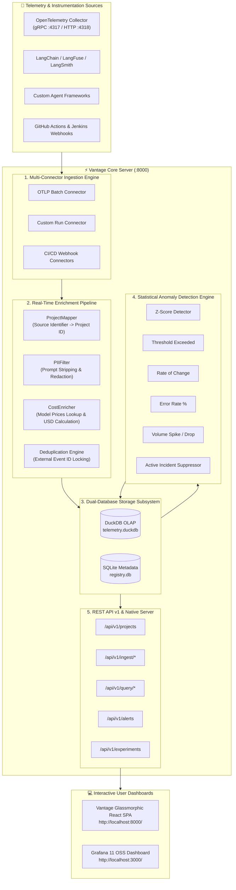

<div align="center">

# ⚡ Vantage — AI Agent & Infrastructure Observability Engine

[](https://github.com/YATHARTHH/vantage/actions)
[](https://pytest.org/)
[](https://python.org)
[](https://fastapi.tiangolo.com)
[](https://react.dev)
[](https://duckdb.org)
[](LICENSE)

> **Universal Observability, Real-Time LLM Token Cost Tracking, Multi-Signal Anomaly Detection, and Experiment Registry for Modern AI Stack Infrastructure.**

<br />


</div>

---

> [!IMPORTANT]
> Vantage is engineered with a **Dual-Database Subsystem**: DuckDB OLAP engine for zero-lag span trace queries & aggregated LLM token cost calculations, paired with SQLite for transactional metadata, project mappings, and experiment registries.

---

## 🌟 Key Features at a Glance

| Feature Module | Capabilities & Description | Supported Connectors |
| :--- | :--- | :--- |
| 📊 **React SPA Dashboard** | Glassmorphic single-page app natively served on port `:8000`. Full project directories, alert banners, and cost breakdown tables. | Integrated React + Vite + TS |
| 💰 **LLM Token Cost Engine** | Real-time USD cost calculation across OpenAI (`gpt-4o`), Anthropic (`claude-3-5`), and Google (`gemini-2.0`) models. | `model_prices.json` pricing table |
| 🔍 **Agent Trace & Run Grouping** | Query-time root agent span cost aggregation (`parent_span_id IS NULL`) preventing trace row multiplication. | OpenTelemetry, Custom Agent Payloads |
| 🚨 **5 Anomaly Detectors** | Statistical detectors (**Z-Score, Threshold, Rate-Change, Error Rate %, Volume Spikes**) + Active Incident Suppression. | Live telemetry streams |
| 🔬 **Experiment Registry** | Model hypothesis tracking, accuracy vs. cost metrics, owner team attributions, and deployment learnings. | REST API v1 (`/api/v1/experiments`) |
| 📈 **Grafana 11 Integration** | Provisioned Grafana OSS dashboard with custom Infinity JSON datasource connected to `/api/v1/query`. | Grafana 11.4.0 Container |

---

## 🏗️ Architecture Overview



---

## 🛠️ Technology Stack

```
Vantage Stack
├── Backend Core     : Python 3.13 | FastAPI | Uvicorn | Pydantic v2 | SQLAlchemy 2.0
├── Analytical DB    : DuckDB OLAP Engine (Columnar Span Traces)
├── Metadata DB      : SQLite + Async SQLAlchemy (aiosqlite)
├── Frontend UI      : React 18.3 | TypeScript | Vite | React Router v6 | Lucide React
├── Container Stack  : Grafana 11.4.0 (Infinity Datasource) | OpenTelemetry Collector 0.115
└── Testing Suite    : Pytest (29 tests passing) | Pytest-Asyncio | HTTPX AsyncClient
```

---

## 🚀 Quickstart Guide

### 1. Repository Setup & Dependencies

```bash
# Clone the repository
git clone git@github-personal:YATHARTHH/vantage.git
cd vantage

# Create Python virtual environment
python -m venv .venv
.\.venv\Scripts\activate   # Windows (or source .venv/bin/activate on Linux/macOS)

# Install Python requirements
pip install -e .
pip install pytz pytest pytest-asyncio uvicorn httpx
```

### 2. Launch Vantage Server (Backend + React SPA)

```bash
# Start Vantage FastAPI application server at port 8000
python -m uvicorn vantage.api.app:app --host 0.0.0.0 --port 8000
```

> [!TIP]
> Navigate to **[http://localhost:8000/](http://localhost:8000/)** in your browser:
> - 📁 **Projects Overview**: `http://localhost:8000/`
> - 🔬 **Experiments Registry**: `http://localhost:8000/experiments`
> - 🚨 **Alerts & Incidents**: `http://localhost:8000/alerts`
> - 📊 **Telemetry Explorer**: `http://localhost:8000/telemetry`
> - 📖 **Swagger OpenAPI Docs**: `http://localhost:8000/docs`

### 3. Launch Grafana Dashboards (Optional)

Ensure Docker Desktop is running, then execute:

```bash
docker compose up -d grafana
```

Navigate to **[http://localhost:3000](http://localhost:3000)** (Credentials: `admin` / `vantage-local`).

---

## 🧪 Verification & Unit Testing

Vantage enforces 100% test passing rate across unit, integration, and E2E ingestion flows:

```bash
pytest tests/ -v
```

---

## 🤝 Community & Contributing

Contributions are welcome! Please check out [CONTRIBUTING.md](CONTRIBUTING.md) for development setup and pull request guidelines.

For security reports, please refer to our [SECURITY.md](SECURITY.md) policy.

---

## 📄 License

This project is open-source software licensed under the **[MIT License](LICENSE)**.
