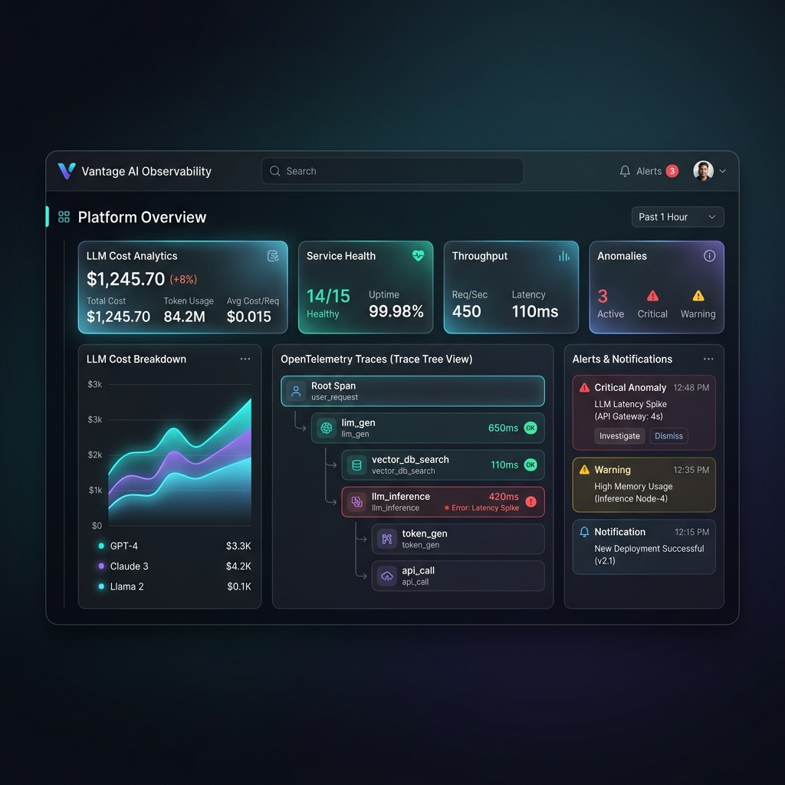
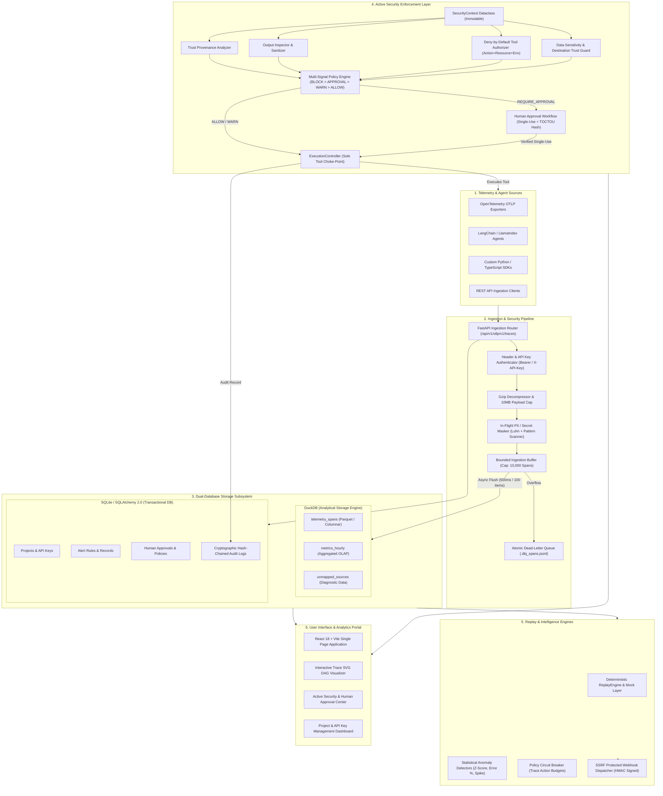

<div align="center">

# ⚡ Vantage — AI Agent Observability & Active Security Enforcement Platform

[](https://github.com/YATHARTHH/vantage/actions)
[](https://pytest.org/)
[](https://python.org)
[](https://fastapi.tiangolo.com)
[](https://react.dev)
[](https://duckdb.org)
[](LICENSE)

> **Universal OpenTelemetry (OTLP) AI Telemetry, In-Flight PII Redaction, Multi-Signal Policy Precedence, Single-Use TOCTOU Human Approvals, Mandatory Execution Choke-Points, and Deterministic Offline Replays.**

<br />



</div>

---

> [!IMPORTANT]
> Vantage transitions AI monitoring from passive observation ("detect and report") to **active runtime enforcement ("authorize and enforce")**.
> Core Imperative: *"Detection provides evidence. Policy makes the decision. Authorization determines capability. Enforcement controls the side effect. Audit records why."*

---

## 🌟 Key Capabilities at a Glance

| Feature Module | Capabilities & Description | Key Architecture Components |
| :--- | :--- | :--- |
| 🛡️ **Active Security Enforcement (v1.2)** | Mandatory execution choke-point (`ExecutionController.execute(...)`) intercepting tool calls prior to execution. Evaluates capability matrix (`Action+Resource+Env`), data sensitivity, and destination trust. | `ExecutionController`, `MultiSignalPolicyGate`, `ToolAuthorizer` |
| 🔒 **TOCTOU Action Fingerprinting** | Cryptographic SHA-256 canonical JSON action hash (`tool`, `action`, `resource`, `environment`, `arguments`). Single-use atomic approval consumption (`consumed_at`) with stale-policy checks. | `HumanApprovalWorkflow`, `ApprovalRecord` |
| 🕵️ **In-Flight PII & Secret Redaction** | In-flight scrubbing of credit cards (validated via Luhn algorithm checksum), SSNs, API keys (`sk-...`, `vg_live_...`), and emails prior to queue buffering and DuckDB persistence. | `PIIMasker`, `JailbreakDetector` |
| ⚡ **Dual-Database Subsystem** | DuckDB vectorized columnar OLAP engine for sub-second analytical queries across millions of spans paired with SQLite/SQLAlchemy 2.0 for transactional state and hash-chained audit logs. | `DuckDBTelemetryRepository`, `SQLiteMetadataRepository` |
| 🔄 **Deterministic Replay Engine** | Reconstructs complete execution state from recorded span trees into a `ReplayManifest`, mocking downstream tools to allow offline debugging and "What-If" prompt tuning without side-effects. | `ReplayEngine`, `ReplayService` |
| 🚨 **5 Anomaly Detectors & Circuit Breakers** | Statistical detectors (**Z-Score, Threshold, Rate-Change, Error Rate %, Volume Spikes**) + Trace Action Budget Circuit Breakers (`max_tool_calls_per_trace`). | `TraceActionCircuitBreaker`, `AbstractDetector` |
| 📊 **React SPA & Interactive SVG DAG** | Glassmorphic React 18 single-page app featuring interactive span DAG visualizer, approval queue workflow, and role capability matrix. | Integrated React + Vite + TS SPA |

---

## 🏗️ End-to-End System Architecture



---

## 📚 Master Documentation Suite (`docs/`)

The repository includes a comprehensive 9-part Master Documentation Suite written from first principles and grounded in the Vantage codebase:

```text
docs/
├── 01_project_vision_usecases_and_requirements.md  # Vision, Use Cases, Differentiators Matrix & Challenges
├── 02_system_architecture_and_tech_stack.md       # Architecture Flowchart, Tech Stack Justifications & 10 ADRs
├── 03_data_model_telemetry_and_storage.md          # Dual-DB Architecture, Canonical Span & 10 Table Schemas
├── 04_security_threat_model_and_active_enforcement.md # OWASP LLM 2025 Mapping, ExecutionController & Hash Audit
├── 05_replay_dag_circuit_breaker_and_intelligence_engines.md # ReplayEngine, SVG DAG, Circuit Breakers & Detectors
├── 06_developer_onboarding_codebase_and_testing.md # Codebase Tree, File Purpose Table & Setup Guide
├── 07_deployment_cicd_scalability_and_sre.md       # Production Dockerfile, GitHub Actions CI/CD & 1M Req Scaling
├── 08_api_otlp_and_integration_reference.md        # REST API Matrix, OTLP Specs & Working cURL Commands
└── 09_interview_prep_glossary_and_faq.md           # 1-Min Pitch, 5-Min System Script, 20+ Technical Q&As & FAQ
```

---

## 🛠️ Technology Stack

```text
Vantage System Stack
├── Core Runtime     : Python 3.12+ | FastAPI | Uvicorn | Pydantic v2 | SQLAlchemy 2.0
├── Analytical DB    : DuckDB Vectorized Columnar OLAP Engine (Parquet Storage)
├── Transactional DB : SQLite + Async SQLAlchemy (aiosqlite)
├── Active Security  : SecurityContext | PolicyGate | ExecutionController | PIIMasker
├── Frontend UI      : React 18.3 | TypeScript | Vite | React Router v6 | Lucide React
├── Container Stack  : Docker | docker-compose | Grafana 11 OSS Integration
└── Testing Suite    : Pytest (69/69 Tests Passing, 100%) | Pytest-Asyncio | HTTPX
```

---

## 🚀 Quickstart Guide

### 1. Repository Setup & Dependencies

```bash
# Clone the repository
git clone https://github.com/YATHARTHH/vantage.git
cd vantage

# Create and activate Python virtual environment
python -m venv .venv

# On Windows (PowerShell):
.\.venv\Scripts\Activate.ps1
# On Linux/macOS:
source .venv/bin/activate

# Install Python requirements
pip install -e .[dev]
```

### 2. Initialize Database & Seed Demo Traces

```bash
python setup_project_and_seed.py
```

### 3. Launch Vantage Server (Backend + React SPA)

```bash
python -m uvicorn vantage.api.app:app --host 0.0.0.0 --port 8000 --reload
```

> [!TIP]
> Navigate to **[http://localhost:8000/](http://localhost:8000/)** in your browser:
> - 📁 **Projects Overview**: `http://localhost:8000/`
> - 🛡️ **Active Security & Approvals**: `http://localhost:8000/enterprise`
> - 🚨 **Alerts & Incidents**: `http://localhost:8000/alerts`
> - 📊 **Telemetry Explorer**: `http://localhost:8000/telemetry`
> - 📖 **Swagger OpenAPI Docs**: `http://localhost:8000/docs`

---

## 🧪 Verification & Automated Testing

Vantage maintains a 100% test pass rate across unit, integration, end-to-end, and adversarial security simulation tests:

```bash
# Run full Pytest test suite (69 tests)
python -m pytest tests/ -v

# Run Adversarial Security Attack Simulations specifically
python -m pytest tests/security/test_attack_simulations.py -v
```

---

## 📄 License

This project is open-source software licensed under the **[MIT License](LICENSE)**.
