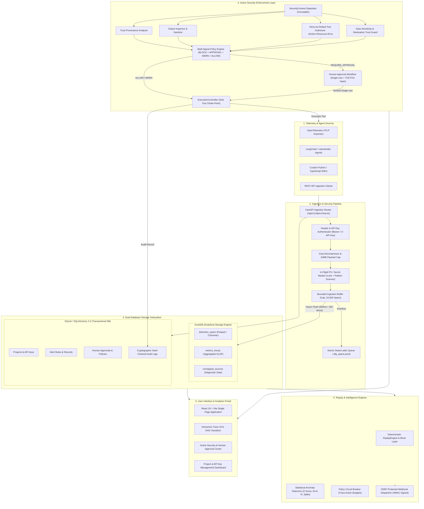

# Vantage System Architecture, Tech Stack Justifications, & Architecture Decision Records (ADRs)

Welcome to **Document 02**! This document provides the complete, production-grade architectural specification of Vantage. It combines high-resolution technical diagrams, exhaustive technology stack trade-off analyses, and formal **Architecture Decision Records (ADRs)**—accompanied by plain-language explanations.

---

## ❓ What is an ADR (Architecture Decision Record)?

> 💡 **Simple Analogy**: Imagine a team of structural engineers building a skyscraper. They must decide: *"Should we use a glass facade or a reinforced steel facade?"* They choose steel because of high-altitude wind resistance. To ensure future maintenance crews don't swap it for glass without understanding why, they write down an official note: **"We selected steel to withstand 120 mph winds."**

In software architecture, an **Architecture Decision Record (ADR)** is that exact note! It is a formal document capturing:
1. **Context**: What problem or constraint were we facing?
2. **Decision**: What technology, pattern, or framework did we choose?
3. **Consequences**: What benefits did we gain, and what trade-offs did we accept?

We maintain ADRs so that any engineer, auditor, or hiring manager reviewing Vantage can understand **WHY** every technical decision was made.

---

## 1. High-Resolution System Architecture Diagram

Below is the complete 6-tier architectural flowchart of Vantage.

### 🏭 Plain-Language Factory Summary of the Architecture
* **Tier 1 (Sources)**: AI agents running anywhere (LangChain, LlamaIndex, Python) stream trace data into Vantage.
* **Tier 2 (Ingestion Pipeline)**: FastAPI authenticates API keys, decompresses payloads, redacts PII/secrets *in flight*, and buffers up to 10,000 spans in memory.
* **Tier 3 (Dual Storage)**: High-speed trace analytics flow into **DuckDB** (columnar OLAP), while strict state (API keys, security policies, audit logs) is saved in **SQLite** (transactional OLTP).
* **Tier 4 (Active Enforcement)**: `ExecutionController` intercepts AI tool calls, checking permissions, scanning for jailbreaks, and requiring human approval when necessary.
* **Tier 5 (Intelligence & Replay)**: Statistical engines detect price spikes, while `ReplayEngine` reconstructs past executions offline.
* **Tier 6 (Frontend Portal)**: A React 18 SPA renders real-time execution DAGs, approval queues, and metric charts.

---

## 2. Tech Stack Justifications & Rejected Alternatives

Vantage was architected with explicit performance, security, and developer velocity trade-offs. Below is the engineering justification for every technology selected versus alternatives rejected.

### A. Core Runtime: Python 3.12+
* **Why Selected**: Python 3.12 provides standard `asyncio` performance enhancements, per-interpreter GIL improvements, and native interoperability with modern AI frameworks (LangChain, LlamaIndex, OpenAI, Anthropic, HuggingFace).
* **Alternatives Rejected**:
  - *Node.js / TypeScript*: Lacks native deep-learning ecosystem integration and scientific computing packages (NumPy, SciPy) required for Z-score anomaly detection algorithms.
  - *Go / Rust*: Excellent raw execution speed, but lacks rapid AI model connector bindings and standard schema definitions present in Python's AI ecosystem.

### B. API Framework: FastAPI
* **Why Selected**: Built on Starlette and Pydantic v2. Provides high-throughput async I/O handling, automatic OpenAPI/Swagger documentation generation, strict data validation via Pydantic models, and low overhead (<2ms router overhead).
* **Alternatives Rejected**:
  - *Flask / Django*: Synchronous execution models lock worker threads during async DuckDB queries and HTTP webhook dispatches, causing severe ingestion bottlenecks under heavy telemetry load.
  - *NestJS*: Adds unnecessary TypeScript transpilation complexity to a backend heavily integrated with Python data science tools.

### C. Analytical Storage Engine: DuckDB
* **Why Selected**: In-process vectorized columnar OLAP database engine. Achieves sub-second analytical aggregations across tens of millions of spans without requiring dedicated server infrastructure. Supports native Parquet file persistence, vectorized SQL processing, and ultra-fast memory scans.
* **Alternatives Rejected**:
  - *ClickHouse / Snowflake*: Incredible scale, but requires complex multi-node infrastructure, zookeeper/ch-keeper setup, and high maintenance costs. Unsuited for lightweight local deployment or embedded single-binary distribution.
  - *PostgreSQL (Standard B-Tree)*: Row-oriented layout degrades rapidly when performing OLAP aggregations (`AVG(latency)`, `SUM(tokens)`, `PERCENTILE(duration, 0.95)`) across millions of unstructured JSON span attributes.

### D. Transactional Storage Engine: SQLite + SQLAlchemy 2.0 (Async)
* **Why Selected**: Zero-configuration, ACID-compliant transactional engine for application state (projects, API keys, alert rules, human approval tokens, hash-chained audit logs). Paired with SQLAlchemy 2.0 using clean async sessions and Alembic migrations.
* **Alternatives Rejected**:
  - *PostgreSQL-only for everything*: Mixing high-frequency streaming telemetry writes with ACID-strict transactional schema updates leads to severe table lock contention and WAL bloat in SQLite/Postgres.
  - *MongoDB / Document DB*: Lack of strict ACID transaction guarantees across multi-row API key revocations and hash-chained audit trails violates security compliance requirements.

### E. Frontend Application: React 18 + Vite + TypeScript
* **Why Selected**: Vite provides instant HMR (Hot Module Replacement) and optimized production bundles. React 18's concurrent rendering allows smooth updates of real-time trace graphs, interactive DAG visualizations, and fast tab navigation. TypeScript ensures zero type-mismatch bugs across frontend API integrations.
* **Alternatives Rejected**:
  - *Next.js (Server-Side Rendering)*: Adds unnecessary SSR server infrastructure complexity for an internal enterprise security and analytics portal where client-side rendering with SPA static bundles hosted directly by FastAPI is cleaner and faster.
  - *Vue / Angular*: React possesses the largest enterprise ecosystem for interactive visualization libraries and SVG graph renderers.

### F. Telemetry Standard: OpenTelemetry (OTLP) + OpenInference
* **Why Selected**: Vendor-neutral industry standard for trace and metric collection. Eliminates vendor lock-in, enabling enterprise agents built with any language or framework to send spans directly to Vantage.
* **Alternatives Rejected**:
  - *Proprietary Custom SDK-only*: Forces developers to re-instrument existing applications and locks telemetry into a single vendor ecosystem.

---

## 3. Architecture Decision Records (ADRs)

### ADR-001: Dual-Database Separation (DuckDB OLAP + SQLite OLTP)
- **Context**: Vantage must ingest thousands of telemetry spans per second while simultaneously handling strict ACID transactional operations for API keys, security policies, and audit logs.
- **Decision**: Separate data storage into two specialized engines: DuckDB for immutable, high-volume columnar span telemetry; SQLite/SQLAlchemy for relational transactional entities.
- **Consequences**: Eliminates database lock contention. Allows analytical queries to scan millions of spans in milliseconds without impacting API key validation or security policy checks.
- **Plain-Language Summary**: We split analytical queries (DuckDB) from security policy rules (SQLite) so huge analytics reports never slow down security checks.

### ADR-002: In-Memory Bounded Queue with Dead-Letter Queue (DLQ)
- **Context**: Ingestion spikes can overwhelm storage backends, causing dropped HTTP connections.
- **Decision**: Implement an in-memory ring buffer (`max_capacity=10000`) with an async background worker flushing every 500ms. Overflows write atomically to `.dlq_spans.jsonl`.
- **Consequences**: Guarantees zero dropped telemetry spans during traffic bursts without requiring a Redis broker for single-instance deployments.
- **Plain-Language Summary**: If traffic spikes suddenly, spans are buffered safely in memory. If memory fills up, extra spans spill over to a disk file (`.dlq_spans.jsonl`) so no data is ever lost.

### ADR-003: Mandatory ExecutionController Choke Point
- **Context**: Untrusted LLM code could potentially bypass security checks if tool invocation is scattered across various agent modules.
- **Decision**: Route ALL tool executions through a single, unified method: `ExecutionController.execute(...)`.
- **Consequences**: Provides complete mediation. Ensures capability authorization, data sensitivity checks, TOCTOU fingerprint validation, and human approvals are enforced without exception.
- **Plain-Language Summary**: Every single AI tool call must pass through ONE single security gate. No tool can execute without passing all checks first.

### ADR-004: Single-Use TOCTOU Action Fingerprinting
- **Context**: An attacker could modify tool arguments or target environments after human approval was granted.
- **Decision**: Hash the complete action context (`tool`, `action`, `resource`, `environment`, `arguments`) into a SHA-256 fingerprint, and enforce atomic single-use approval consumption (`consumed_at`).
- **Consequences**: Completely eliminates Time-Of-Check-To-Time-Of-Use (TOCTOU) tampering and approval replay attacks.
- **Plain-Language Summary**: When a manager approves a request, we lock the exact arguments with a digital SHA-256 stamp. If the AI changes the parameters right before execution, it is blocked.

### ADR-005: Fail-Closed Security Enforcement vs. Fail-Safe Telemetry Ingestion
- **Context**: A failure in a security scanner or policy gate could either halt the application or allow unauthorized execution.
- **Decision**: Enforce Fail-Closed (`BLOCK`) for agent tool execution when security scanners fail; enforce Fail-Safe (safe buffer degradation) for telemetry ingestion.
- **Consequences**: Prevents security breaches during component outages while ensuring observability collection does not bring down the host platform.
- **Plain-Language Summary**: If a security scanner crashes, Vantage defaults to **BLOCKING** the action to keep your system safe.

### ADR-006: In-Flight PII Redaction Before Persistence
- **Context**: Storing raw PII (credit cards, SSNs, secrets) in telemetry storage violates HIPAA, GDPR, and PCI-DSS compliance.
- **Decision**: Execute `PIIMasker` directly in the ingestion pipeline before buffering or writing spans to DuckDB.
- **Consequences**: Telemetry storage never retains raw sensitive secrets. Non-sensitive tags (`pii_scrubbed=true`, `pii_types=[...]`) are retained for auditing.
- **Plain-Language Summary**: Credit cards and secrets are scrubbed in memory *before* saved to disk so sensitive user data is never stored.

### ADR-007: Cryptographic Hash-Chained Audit Trail
- **Context**: Audit logs stored in standard database tables can be silently altered or deleted by a compromised admin or database user.
- **Decision**: Chain audit log entries using SHA-256 hashes where `hash_i = SHA256(entry_i + hash_{i-1})`.
- **Consequences**: Any modification, insertion, or deletion of past audit entries immediately invalidates the cryptographic chain, providing tamper-evident forensic compliance.
- **Plain-Language Summary**: Audit log rows are cryptographically linked using SHA-256. If anyone tries to alter past logs in the database, the hash chain breaks instantly.

### ADR-008: Dispatch-Time DNS Resolution for Webhooks (SSRF Firewall)
- **Context**: Webhooks pointing to external URLs can be exploited via Server-Side Request Forgery (SSRF) or DNS rebinding to access internal private networks (`127.0.0.1`, `169.254.169.254`).
- **Decision**: Re-resolve target hostnames to IP addresses immediately before socket connection in `webhook_notifier.py`, rejecting loopback, RFC1918, or cloud metadata IPs. Disable HTTP redirects (`follow_redirects=False`).
- **Consequences**: Completely blocks SSRF and DNS rebinding attacks on outbound webhooks.
- **Plain-Language Summary**: Webhooks check destination IP addresses right before sending data to prevent hackers from targeting internal private networks.

### ADR-009: Multi-Signal Deterministic Precedence Policy Engine
- **Context**: Heuristic threat scores alone are easily obfuscated by adversarial prompt injection.
- **Decision**: Implement a policy engine combining threat scores, tool risk, data classification, and capability scope into a strict precedence hierarchy: `BLOCK > REQUIRE_APPROVAL > WARN > ALLOW`.
- **Consequences**: Negative security signals hard-deny execution regardless of positive heuristics, creating a robust defense-in-depth model.
- **Plain-Language Summary**: Security decisions follow a strict hierarchy: `BLOCK` beats `APPROVAL`, `APPROVAL` beats `WARN`, `WARN` beats `ALLOW`.

### ADR-010: Native OpenInference & OTLP Protocol Mapping
- **Context**: Enterprise applications use diverse framework abstractions (LangChain, LlamaIndex, custom OpenAI API wrappers).
- **Decision**: Map all ingress telemetry into a unified standard model (`CanonicalVantageSpan`) adhering to OpenTelemetry GenAI semantic conventions (`gen_ai.usage.input_tokens`, `gen_ai.input.messages`).
- **Consequences**: Vantage maintains total independence from agent framework implementation details.
- **Plain-Language Summary**: Vantage uses open standard telemetry formats so it works with any agent framework without requiring custom plugins.

